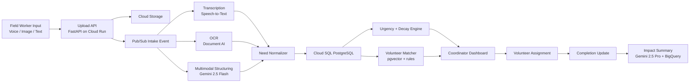

# SEVA Architecture

## One-Line Architecture

SEVA ingests raw field signals, extracts structured needs, prioritizes them by urgency and geography, and routes them to the best-fit volunteers with explainable AI-assisted scoring.

## System Goals

- Accept low-friction field inputs in real-world formats
- Convert noisy data into structured, trustworthy operational records
- Give coordinators a live, locality-level view of demand
- Recommend volunteers quickly and transparently
- Produce measurable impact outputs for NGO leaders and donors

## High-Level Flow



## Core Components

### 1. Intake Layer

Purpose:
Collect data without forcing NGOs to adopt rigid workflows.

Input types:

- WhatsApp-style voice note
- Photo of handwritten form
- Short text update
- Google Form payload or CSV import later

Recommended implementation:

- FastAPI upload endpoint on Cloud Run
- Media files stored in Cloud Storage
- New upload emits a Pub/Sub event for async processing

Why this matters:
Uploads stay fast, and AI processing does not block the user interface.

### 2. Extraction Layer

Purpose:
Turn informal inputs into machine-usable need records.

Recommended pipeline:

- Audio -> Speech-to-Text
- Image or scanned survey -> Document AI OCR
- OCR text or raw text -> Gemini 2.5 Flash with structured JSON output

Expected extracted fields:

- `need_id`
- `source_type`
- `reported_language`
- `location_text`
- `lat`
- `lng`
- `category`
- `subcategory`
- `urgency_level`
- `people_affected`
- `special_flags`
- `required_skills`
- `confidence_score`
- `reported_at`

Prompting principle:
Do not ask Gemini to do everything from raw pixels when handwritten quality is poor. Use OCR first, then reasoning.

### 3. Validation and Prioritization Layer

Purpose:
Reduce noise and help coordinators focus on what matters now.

Logic:

- Deduplicate similar reports within a radius and time window
- Increase score when multiple independent reports mention the same locality
- Apply urgency decay so stale needs fade over time
- Raise priority if medical or child-risk keywords are present

Suggested urgency formula:

```text
priority_score =
  severity_weight
  + vulnerability_weight
  + recency_weight
  + corroboration_weight
  - stale_decay
```

### 4. Volunteer Matching Engine

Purpose:
Recommend the best volunteer for each task with a reason the coordinator can trust.

Matching signals:

- Skill fit
- Distance to site
- Current availability
- Language compatibility
- Historical task completion reliability
- Task urgency

Recommended scoring shape:

```text
match_score =
  0.35 * skill_similarity
  + 0.25 * proximity_score
  + 0.15 * availability_score
  + 0.15 * reliability_score
  + 0.10 * language_score
```

Use `pgvector` for semantic similarity on skill and task embeddings, then combine with rule-based filters and weighted scoring.

### 5. Coordinator Dashboard

Purpose:
Show operational insight, not just raw data.

Views:

- Heatmap of need intensity
- Category filters: food, shelter, medical, education
- New and escalating cases
- Match recommendations
- Assignment queue
- Volunteer status board

### 6. Impact Layer

Purpose:
Translate operations into proof of impact.

Outputs:

- Families served today
- Active volunteers
- Average time from report to assignment
- High-need localities covered
- Category-wise interventions

This becomes valuable for:

- NGO operations
- donor reporting
- CSR partners
- local government collaboration

## Recommended Data Model

Main tables:

- `users`
- `volunteers`
- `skills`
- `volunteer_skills`
- `need_reports`
- `normalized_needs`
- `assignments`
- `completion_logs`
- `impact_snapshots`

Vector-enabled columns:

- `volunteers.skill_embedding`
- `normalized_needs.task_embedding`

## MVP Scope vs Future Scope

### MVP for the challenge

- Audio, image, and text intake
- Need extraction
- Live map
- Explainable volunteer matching
- Completion logging
- Basic impact summary

### Future scope

- WhatsApp Business integration
- Offline-first field app
- multilingual voice bot
- predictive demand forecasting with Vertex AI
- district-level resource planning
- NGO-to-NGO volunteer pooling

## Why This Architecture Is Judging-Friendly

- Clear AI role: multimodal extraction, prioritization support, and impact narrative generation
- Strong technical story: event-driven backend, structured extraction, vector matching, live visualization
- Scalable by design: Cloud Run, Pub/Sub, Cloud Storage, Cloud SQL
- Strong social outcome story: faster response, better coverage, better accountability

## Architecture Decisions

### Why Cloud Run

- Fast to deploy
- serverless
- cheap for demos
- easy to scale later

### Why Cloud SQL over Supabase

- Better alignment with your GCP credits
- clean Google-native submission story
- `pgvector` support for matching

### Why Firebase Auth

- quick setup
- battle-tested login flows
- works well for hackathon speed

### Why Speech-to-Text plus Document AI plus Gemini

- each tool does the job it is strongest at
- improves reliability compared with a single-model everything pipeline
- sounds more production-ready to judges

## Demo Scenario Recommendation

Use one emotionally clear scenario for the full demo:

`Urban flood response in Chennai`

Why it works:

- understandable and high-stakes
- easy to show food, medicine, shelter, and child safety as categories
- map visualization feels meaningful
- volunteer routing is intuitive

Alternative:

`Heatwave relief in Delhi`

This is also strong because it enables water, medical aid, and elderly support use cases.
